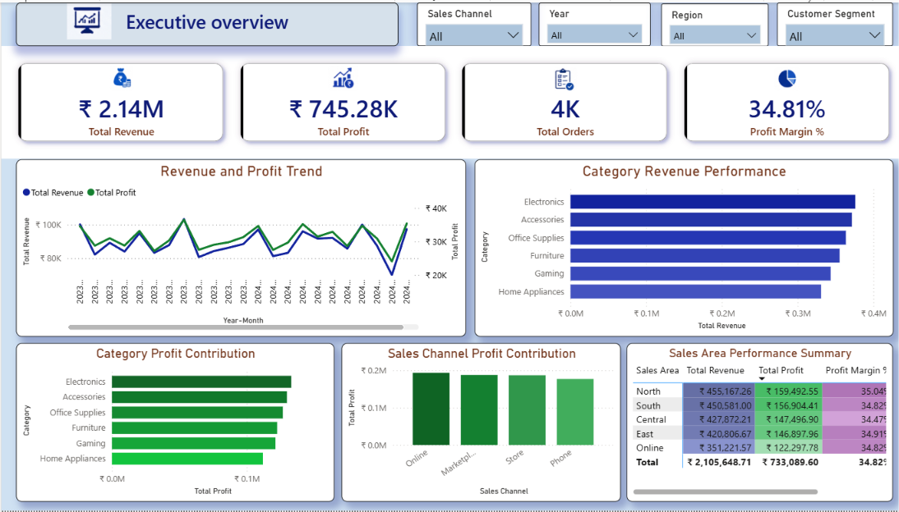
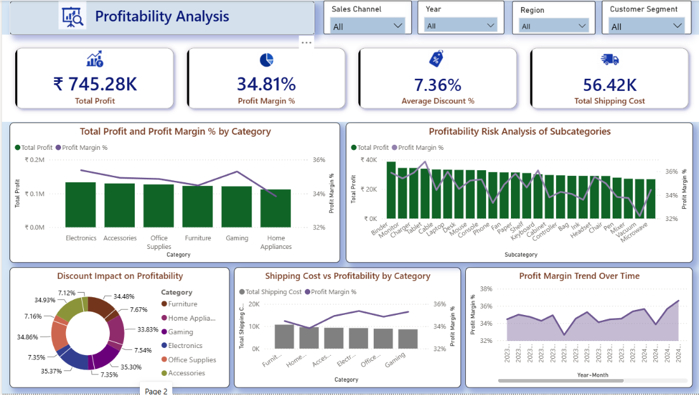
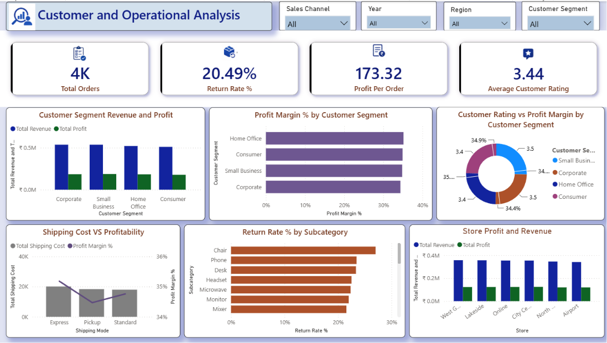
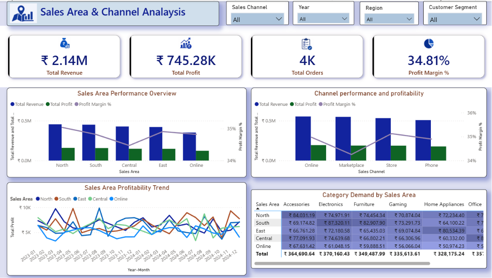
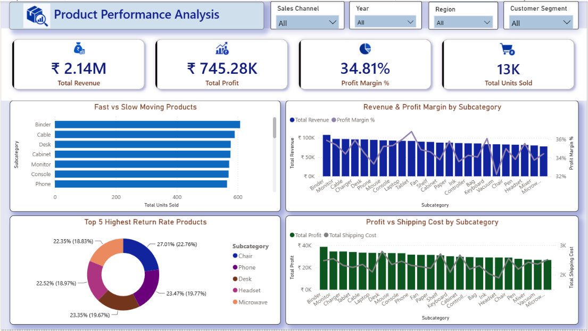

# Multi-Channel Profitability & Customer Growth Analysis

### From Raw Retail Transactions to Strategic Business Decisions

> A consulting-style business analytics project that transforms raw retail transaction data into decision-ready business insights through SQL, Power BI, and a structured end-to-end analytical workflow.

<p align="center">
    
</p>

<p align="center">


</p>

---

# 📌 Project at a Glance

| Attribute | Details |
|-----------|---------|
| **Business Domain** | Multi-Channel Retail |
| **Project Type** | End-to-End Data Analytics Portfolio Project |
| **Tools & Technologies** | SQL, MySQL, Power BI, DAX, Power Query |
| **Analytical Area** | Trend Analysis, Profitability Analysis, Customer Intelligence, Operational Intelligence, Sales Area & Channel Intelligence, Product Performance |
| **Repository Contents** | SQL Data Investigation, SQL Data Cleaning & Transformation, SQL Business Analysis, Interactive Power BI Dashboard, Business Case Study |

---

# Executive Overview

Data becomes valuable only when it is transformed into insights that support confident business decisions. This project demonstrates how a structured analytics workflow converts raw retail transaction data into reliable business intelligence through data investigation, SQL-based data preparation, business analysis, interactive reporting, and strategic recommendations.

Using a multi-channel retail dataset, the analysis examines six interconnected business perspectives: Executive Performance, Profitability Analysis, Customer Intelligence, Operational Intelligence, Sales Area & Channel Intelligence, and Product Performance. Rather than evaluating these areas independently, the project integrates them to provide a comprehensive understanding of business performance and the factors influencing sustainable growth.

The project follows the complete analytics lifecycle—from data investigation and quality assessment to SQL data cleaning, business analysis, Power BI dashboard development, and evidence-based recommendations. Each stage builds upon the previous one, ensuring that every business insight is supported by reliable, well-prepared data and a structured analytical methodology.

---

# Business Context

Retail organizations generate large volumes of transactional data across products, customers, sales channels, and geographical markets. While this data captures day-to-day business activity, meaningful decision-making requires understanding how financial performance, customer behaviour, operational efficiency, regional performance, and product demand interact to influence overall business outcomes.

This project addresses that challenge through a connected analytical framework that brings these business perspectives together into a single analytical solution. By analyzing the relationships between key performance areas rather than isolated metrics, the project identifies performance drivers, uncovers operational risks, and delivers evidence-based recommendations that support strategic business decisions.

---

# Project Objectives

The project aims to:

- Evaluate overall business performance using integrated financial and operational KPIs.
- Identify the key drivers of revenue, profitability, and sustainable business growth.
- Analyze customer behavior, operational performance, Sales Area trends, sales channel performance, and product demand through connected business perspectives.
- Transform raw transactional data into a reliable analytical dataset using structured SQL data investigation and data preparation.
- Develop an interactive Power BI dashboard that supports executive decision-making through intuitive business visualizations.
- Deliver evidence-based business insights and strategic recommendations that support informed business decisions.

---

# Project Methodology

This project follows a structured end-to-end data analytics workflow designed to transform raw retail transaction data into reliable business insights. Each stage was completed sequentially to ensure that business decisions were supported by validated data, structured analysis, and documented findings.

The project begins with understanding the business problem, followed by data investigation, SQL-based data preparation, business analysis, dashboard development, and strategic recommendations. This structured approach ensures that every insight presented in the final dashboard is supported by reliable data and a well-defined analytical process.

---

# Analytical Workflow


```text
🧩 Business Understanding
            │
            ▼
🔍 Data Investigation
            │
            ▼
🧹 SQL Data Cleaning & Transformation
            │
            ▼
📊 SQL Business Analysis
            │
            ▼
🏗️ Power BI Data Modeling
            │
            ▼
📈 Dashboard Development
            │
            ▼
💡 Business Insight Generation
            │
            ▼
🎯 Strategic Recommendations
```

The workflow illustrates the complete analytical lifecycle followed throughout the project, showing how each stage contributes to building reliable insights that support business decision-making.

---

# Dataset Overview

The dataset contains **19 fields** covering order information, sales structure, customer segments, product attributes, financial metrics, operational costs, returns, customer ratings, and transaction-level fulfillment details.

| Field Group | Key Fields |
|---|---|
| **Order & Sales Structure** | `Order ID`, `order_date`, `Store`, `Region`, `Sales Channel` |
| **Customer** | `Customer Segment`, `customer_rating` |
| **Product** | `Category`, `Subcategory`, `SKU` |
| **Financial** | `quantity`, `unit_price`, `discount_percent`, `revenue`, `cogs` |
| **Operations** | `shipping_cost`, `returned`, `Shipping Mode` |
| **Transaction Details** | `Payment Method` |

---

The dataset combines commercial, financial, customer, product, and operational attributes required to evaluate business performance across the project's analytical framework.
# Why This Methodology?

This project does not begin with a cleaned dataset and end with a dashboard. This project follows a broader analytical workflow that places equal importance on business understanding, data quality, structured analysis, and evidence-based recommendations.

Key characteristics of the methodology include:

- Business objectives were established before technical analysis began.
- Data quality investigation informed the SQL data cleaning strategy.
- SQL was used for both data preparation and business analysis.
- Analysis was organized into six interconnected business domains rather than isolated reports.
- Dashboard findings are supported by validated SQL analysis.
- Strategic recommendations are derived from analytical evidence rather than visual observations alone.

This methodology reflects the complete workflow used to transform raw business data into reliable insights that support informed decision-making.

---

# 📊 Power BI Dashboard

The analytical findings from this project were translated into a five-page interactive **Power BI Business Intelligence solution** designed to support evidence-based decision-making.

Rather than presenting isolated reports, the dashboard follows a connected analytical journey where each page builds upon the previous one. Executive performance, profitability, customer behavior, operational efficiency, sales area performance, sales channel effectiveness, and product performance are integrated into a unified analytical framework that enables stakeholders to understand business performance from multiple perspectives.

---

# 🗂️ Dashboard Structure

| Dashboard Page | Business Purpose |
|----------------|------------------|
| 📈 Executive Overview | Provides a consolidated view of overall business performance through executive KPIs and integrated performance trends, establishing business context before deeper analysis. |
| 💰 Profitability Analysis | Evaluates profitability drivers by examining profit, profit margin, discounts, shipping costs, and category performance to understand the factors influencing financial outcomes. |
| 👥 Customer & Operational Analysis | Analyzes customer value, purchasing behavior, customer ratings, return patterns, and operational efficiency to understand how customer experience and business operations collectively influence performance. |
| 🌍 Sales Area & Channel Analysis | Compares business performance across sales areas and sales channels to identify geographical and channel-based opportunities for sustainable business growth. |
| 📦 Product Performance Analysis | Evaluates product demand, revenue contribution, profitability, and return behavior to support product strategy, inventory planning, and long-term business growth. |

---

# 🖥️ Dashboard Walkthrough

## 📈 Executive Overview

**Purpose**

The Executive Overview serves as the entry point to the analytical journey by presenting executive-level KPIs alongside integrated performance trends. It establishes the overall business context, enabling decision-makers to quickly assess business health before exploring the underlying drivers of performance.

<p align="center">
  
</p>

---

## 💰 Profitability Analysis

**Purpose**

This page investigates the financial drivers behind business performance by evaluating profit, profit margins, discount effectiveness, shipping costs, and category profitability. Trend analysis is integrated throughout the page to reveal how financial performance changes over time and to highlight opportunities for improving sustainable profitability.

<p align="center">
  
</p>

---

## 👥 Customer & Operational Analysis

**Purpose**

This page combines customer intelligence with operational performance to provide a connected view of customer behavior and business operations. It examines customer profitability, purchasing behavior, customer ratings, return patterns, and operational efficiency, enabling stakeholders to identify opportunities that improve both customer value and operational effectiveness.

<p align="center">
  
</p>

---

## 🌍 Sales Area & Channel Analysis

**Purpose**

This page evaluates business performance across different sales areas and sales channels to identify where the business performs most effectively. By integrating trend analysis with geographical and channel comparisons, stakeholders can recognize market opportunities, evaluate channel effectiveness, and support more informed business expansion strategies.

<p align="center">
  
</p>

---

## 📦 Product Performance Analysis

**Purpose**

The analytical journey concludes with Product Performance Analysis, where business performance is translated into product-level decision-making. This page evaluates product demand, revenue contribution, profitability, return behavior, to support product strategy and sustainable business growth. 

<p align="center">
  
</p>

---

 ## 📖 Dashboard Storytelling Approach

The dashboard follows a structured analytical journey that progressively explains business performance instead of presenting isolated metrics. Beginning with an executive overview and continuing through profitability, customer behavior, operational performance, sales area and channel analysis, and product performance, each page builds upon the previous one to create a connected analytical experience.

By integrating executive KPIs, financial performance, customer intelligence, operational metrics, sales area analysis, and product insights within a unified Business Intelligence framework, the dashboard enables stakeholders to monitor business performance, identify improvement opportunities, and make more informed strategic decisions.

---

## 💡 Executive Insights

The connected analysis produced several conclusions with direct strategic significance:

| Executive Insight | Strategic Meaning |
|---|---|
| **Stable Performance With Predictable Seasonal Demand** | Recurring patterns can support more proactive planning and resource allocation. |
| **Sustainable Growth Depends on Growth Quality, Not Revenue Alone** | Commercial scale should be evaluated alongside profitability. |
| **Profitability Is Influenced by Multiple Connected Drivers** | Pricing, discounts, shipping costs, product economics, and operations should be considered together. |
| **Customer Value Extends Beyond Revenue Contribution** | Revenue, profitability, and customer satisfaction provide a more complete view of customer value. |
| **Operational Performance Plays a Critical Role in Overall Business Success** | Returns, shipping efficiency, and store performance can influence both financial and customer outcomes. |
| **Market Performance Should Be Evaluated Through Both Scale and Efficiency** | Revenue alone does not provide a complete basis for comparing sales areas and channels. |
| **Product Performance Reflects Both Current Success and Future Growth Potential** | Demand should be evaluated together with profitability and operational efficiency. |
| **Business Performance Cannot Be Understood Through Isolated Metrics** | Reliable conclusions emerged from integrating multiple analytical perspectives. |

These insights reinforce the central conclusion of the project:

> **Business performance is better understood through connected evidence than through isolated metrics.**

---

## 🎯 Strategic Recommendations

The analysis produced a set of strategic directions based on recurring patterns identified across the connected analytical framework. Rather than responding to isolated metrics, the recommendations consider financial performance, customer value, operational efficiency, sales area and channel performance, product demand, and business trends together.

### 1. Build a More Proactive Business Planning Process

The analysis identified recurring seasonal patterns in revenue and profitability, providing a basis for more predictable planning.

**Strategic direction:** Use established demand patterns to strengthen inventory readiness, workforce planning, promotional timing, and operational scheduling.

### 2. Strengthen Performance Management Beyond Revenue Growth

Across products, customer segments, sales areas, and channels, stronger revenue did not consistently correspond with stronger profitability.

**Strategic direction:** Evaluate growth through both commercial scale and financial quality, ensuring that revenue expansion is supported by sustainable profitability.

### 3. Adopt an Integrated Profitability Management Approach

Profitability was influenced by interconnected drivers including pricing behavior, discounts, shipping costs, operational performance, and product economics.

**Strategic direction:** Evaluate profitability through its underlying drivers rather than relying on individual financial metrics in isolation.

### 4. Refine Customer Strategy Around Long-Term Business Value

Customer analysis showed that larger customer segments did not automatically represent the strongest business value when profitability and customer satisfaction were considered alongside revenue.

**Strategic direction:** Evaluate customer segments through both commercial contribution and profitability to identify customer groups that support sustainable value.

### 5. Launch Targeted Operational Improvement Reviews

Returns, shipping performance, and store performance demonstrated that operational effectiveness can directly influence profitability and customer experience.

**Strategic direction:** Prioritize operational reviews in areas where cost, return behavior, or performance pressure may affect broader business outcomes.

### 6. Prioritize Markets Using Both Commercial Scale and Business Efficiency

Sales area and channel analysis revealed meaningful differences between commercial scale, profitability, and operational efficiency.

**Strategic direction:** Balance market size with financial and operational performance when prioritizing expansion, investment, and resource allocation.

### 7. Strengthen Product Portfolio Management Through Multi-Dimensional Evaluation

Product demand analysis distinguished between products contributing to current performance, products generating operational pressure, and products presenting future growth opportunities.

**Strategic direction:** Evaluate products using demand, profitability, return behavior, and operational efficiency to support portfolio development and sustainable growth.

### 8. Establish Connected Performance Management Across the Organization

The strongest business understanding emerged only after integrating trend analysis, profitability, customer intelligence, operational performance, sales area and channel performance, and product demand.

**Strategic direction:** Use connected performance management to evaluate business performance as an integrated system rather than as a collection of independent metrics.

---

## 🧠 Key Analytical Design Decisions

The quality of the analysis was shaped not only by the tools used, but by several decisions made before and during the analytical process.

### 1. Redefining the Business Perspective Before Starting the Analysis

The dataset's `Region` field included values such as `Online`, indicating that it represented operational coverage rather than purely geographical regions.

**Decision:** The analysis therefore adopted **Sales Area** as the business-facing terminology.

**Why it matters:** The terminology better reflects the information represented by the data and improves consistency across the SQL analysis, dashboard, case study, and recommendations.

### 2. Designing the Analytical Framework From Business Decisions

The analytical framework was designed around the business decisions management would need to make rather than around individual dataset columns.

This resulted in six connected analytical domains:

**Trend Analysis → Profitability Intelligence → Customer Intelligence → Operational Intelligence → Sales Area & Channel Intelligence → Product Demand Intelligence**

**Why it matters:** The analysis moves beyond reporting individual dimensions and instead examines how different business perspectives collectively explain overall performance.

### 3. Challenging Business Terminology Instead of Accepting It

Dataset field names were reviewed against the actual business meaning represented by the data.

**Decision:** Where the original terminology did not accurately communicate the business perspective, it was refined for the analytical and reporting layers.

**Why it matters:** Clear terminology reduces ambiguity and improves the consistency of the analysis, dashboard, and recommendations.

### 4. Treating Business Metrics as Connected Evidence

Business findings were interpreted by examining how multiple performance areas influenced one another rather than evaluating every KPI independently.

Revenue trends, profitability, customer behavior, operational performance, sales areas, channels, and product demand were therefore interpreted as interconnected components of the same business system.

**Why it matters:** This approach helps explain not only **what happened**, but also how different aspects of the business contributed to those outcomes.

### 5. Building Recommendations From Recurring Business Patterns

Strategic recommendations were developed only after recurring patterns had been established across multiple analytical perspectives.

**Why it matters:** Recommendations are supported by consistent evidence from the connected framework rather than by isolated charts or individual observations.

---

## 🛠️ Technical Highlights

### SQL

- Investigated data quality through structured validation and exploratory queries.
- Resolved data issues including duplicate records, invalid export-generated rows, missing values, inconsistent categorical values, and mixed date formats.
- Prepared the dataset for downstream business analysis.
- Developed analytical queries across profitability, customer, operational, sales area, channel, product, and trend perspectives.
- Generated KPIs, validated business assumptions, and supported the final analytical reporting.

### Power BI

- Built a star-schema data model to support business analysis.
- Created DAX measures for business KPIs and performance evaluation.
- Built interactive dashboards covering multiple connected business perspectives.
- Designed five dashboard pages as a connected analytical narrative rather than independent reports.
- Integrated trend analysis throughout the dashboard instead of presenting it as a standalone page.
- Balanced analytical depth with clear business communication.

### Analytical Thinking

- Translated business questions into six connected analytical domains.
- Designed the analytical framework around business decisions rather than dataset columns alone.
- Connected evidence across multiple business perspectives to evaluate overall performance.
- Selected KPIs based on their ability to answer business questions and support decision-making.
- Translated analytical findings into executive insights and evidence-based strategic recommendations.

### Business Communication

- Produced a consulting-style case study documenting the analytical process, findings, design decisions, and recommendations.
- Communicated technical analysis in language suitable for both business and technical stakeholders.
- Connected executive insights and strategic recommendations to evidence from the analytical framework.
- Presented the final analysis through an interactive Business Intelligence solution.

## 📦 Project Deliverables

| Deliverable | What It Provides |
|---|---|
| **Power BI Dashboard** | A five-page interactive Business Intelligence solution covering executive performance, profitability, customer and operational performance, sales area and channel performance, and product performance. |
| **SQL Analysis** | Structured data validation, preparation, KPI development, and analytical investigation across the project's business domains. |
| **Business Case Study** | Detailed documentation of the business context, analytical framework, executive insights, strategic recommendations, analytical design decisions, and technical capabilities demonstrated. |
| **Dashboard Images** | High-quality previews of all five completed Power BI dashboard pages. |
| **Case Study** | Detailed analytical case study documenting the business context, methodology, analysis, findings, and strategic recommendations. |
---

## 🔎 Analytical Scope

The project examines business performance through six connected analytical domains:

### 1. Trend Analysis
Evaluates revenue, profitability, seasonality, and changes in business performance over time.

### 2. Profitability Intelligence
Examines profit, profit margin, discounts, shipping costs, product economics, and the factors influencing financial performance.

### 3. Customer Intelligence
Evaluates customer segments, revenue contribution, profitability, ratings, and customer value.

### 4. Operational Intelligence
Examines returns, shipping performance, store performance, and operational efficiency.

### 5. Sales Area & Channel Intelligence
Compares performance across sales areas and channels using revenue, profitability, efficiency, and growth perspectives.

### 6. Product Demand Intelligence
Evaluates product demand, profitability, return behavior, operational performance, and future growth potential.

**Note:** Trend Analysis is intentionally integrated throughout the dashboard rather than presented as a separate dashboard page, allowing performance over time to be interpreted within each business perspective.

---

## 📌 About the Project

**Multi-Channel Profitability & Customer Growth Analysis** is a data analysis portfolio project focused on understanding business performance across financial, customer, operational, sales area, channel, and product perspectives.

The project was developed as a connected analytical solution rather than a collection of isolated reports. The analysis begins by establishing the business context represented by the dataset, followed by data quality investigation, SQL-based analysis, Power BI reporting, interpretation of connected business findings, and development of evidence-based strategic recommendations.

A central principle of the project was to design the analytical framework around **business decisions and questions**, rather than simply organizing the analysis around the columns available in the dataset.

The final solution brings together:

**Data Validation → SQL Analysis → Analytical Reasoning → Power BI Reporting → Executive Insights → Strategic Recommendations**

**Role:** Data Analyst  
**Tools:** SQL · MySQL · Power BI · DAX · Power Query

---

